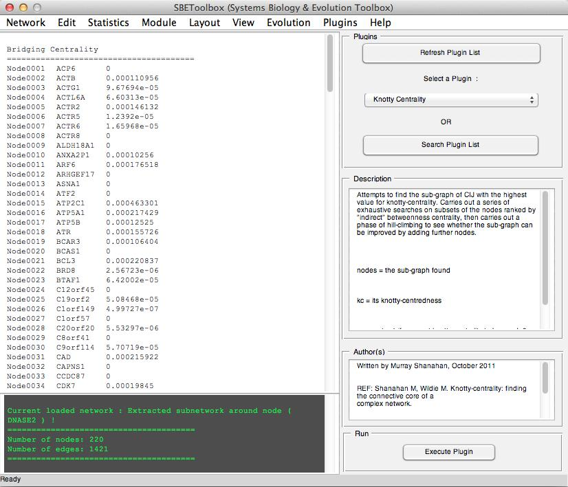
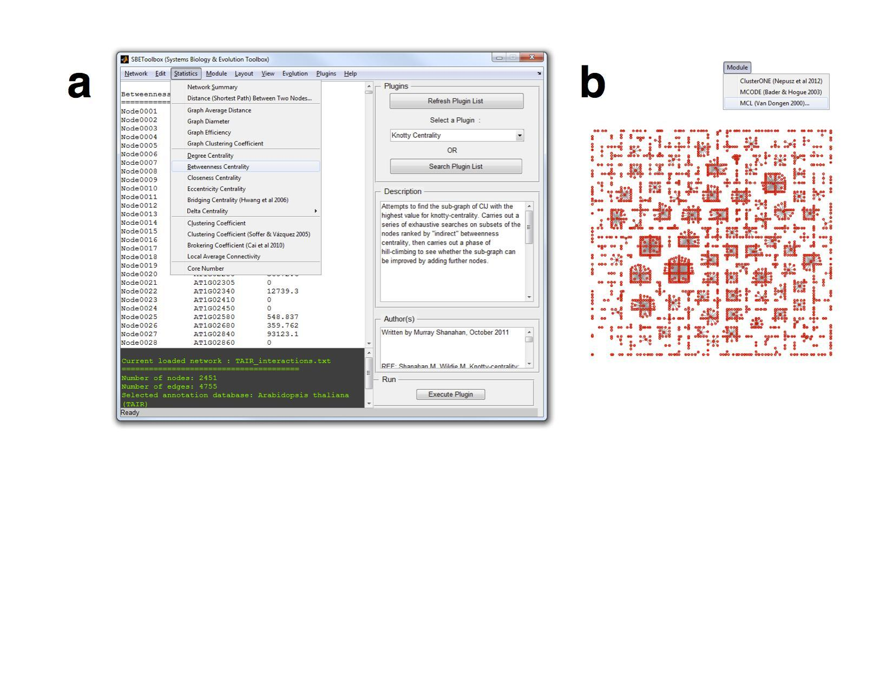
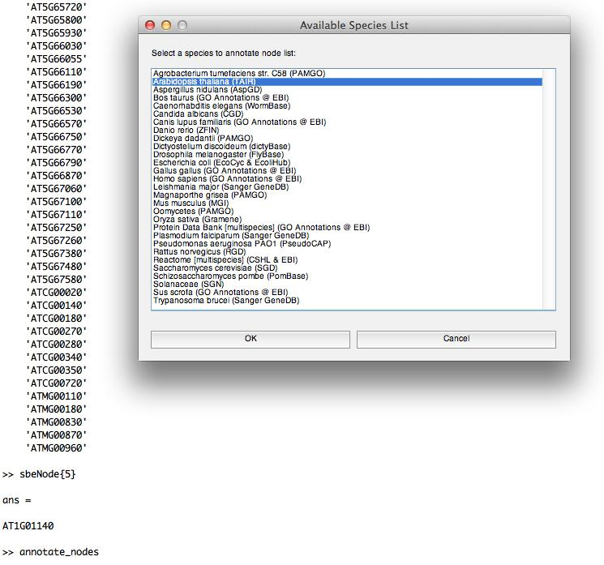
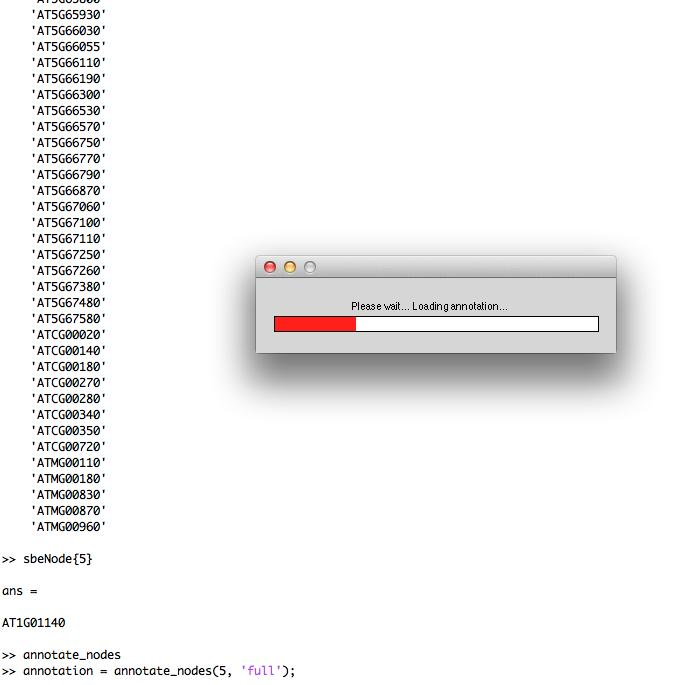
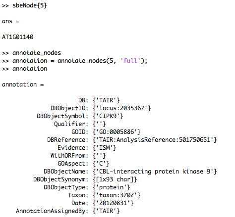

SBEToolbox 
==========

SBEToolbox (Systems Biology and Evolution Toolbox) is developed in MATLAB as a menu-driven UI software to determine various statistics of the biological network. 

Some of its features include (but not limited to): algorithms to create random networks (small-world, ring lattice etc..), deduce clusters in the network (MCL, mCode, clusterOne) etc...

Short WIKI: https://wsgi-promis.tamu.edu/projects/sbetoolbox/wiki/SBEToolbox_User_Manual.

Some Screencasts: http://vimeo.com/64151952 and http://vimeo.com/63437114.

Contact us on Twitter (@SBEToolbox).

Reference
---------
**Konganti K, Wang G, Yang E, Cai JJ* (2013). SBEToolbox: a Matlab Toolbox for Biological Network Analysis.** [Evolutionary Bioinformatics 2013:9 355-362](http://dx.doi.org/10.4137/EBO.S12012)

